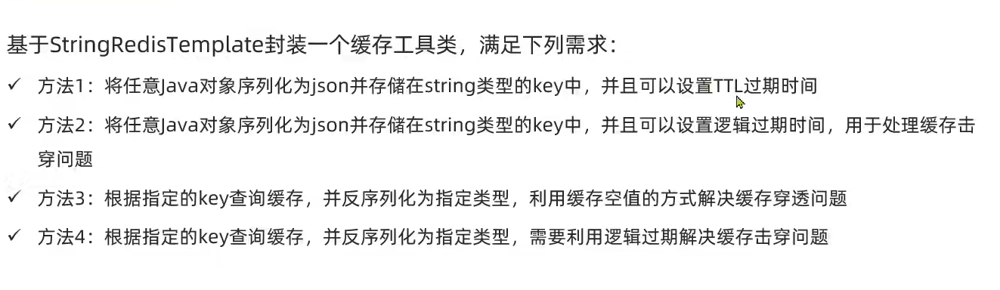

# 黑马点评

### 短信发送

### 商户查询缓存

#### 解决缓存雪崩

缓存雪崩是指在同一时间大量的缓存数据同时失效，导致所有这些请求都落到数据库上，可能会造成数据库瞬时压力过大，甚至导致系统崩溃的问题。解决缓存雪崩的策略通常包括：

1. **缓存数据的过期时间分散**:
    - 给缓存数据设置的过期时间加上一个随机值，这样可以避免大量缓存数据同时过期。
    - 这种策略可以分散缓存失效的时间，减少对数据库的压力。
2. **使用高可用的缓存架构**:
    - 比如使用集群、主从复制、哨兵等机制，确保缓存服务的高可用性。
    - 即使部分缓存节点出现问题，其他节点仍然可以提供服务。
3. **设置缓存数据的合理过期时间**:
    - 根据不同类型的数据特点设置合理的过期时间。
    - 对于一些不常变动的数据，可以设置较长的过期时间或不设置过期时间。
4. **限流降级**:
    - 在系统接口层添加限流措施，比如使用令牌桶、漏桶算法等。
    - 在缓存雪崩发生时，通过降级策略暂时屏蔽部分服务或返回默认值，保护数据库和系统稳定。
5. **预加载重要数据**:
    - 在缓存即将过期前，通过后台任务主动更新缓存数据。
    - 这样可以保证数据在过期之前已经被更新，避免雪崩。
6. **监控报警和自动扩容**:
    - 实施实时监控和设置报警机制，当缓存使用率、访问频率等指标异常时及时发现问题。
    - 结合自动扩容机制，当系统负载增加时自动增加缓存或数据库的处理能力。
7. **使用熔断机制**:
    - 当后端服务（如数据库）负载过高时，启动熔断机制，暂时停止部分或全部请求，防止系统崩溃。

#### 缓存更新策略

在使用 Redis 作为缓存时，合理的缓存更新策略是至关重要的，以确保数据的一致性和性能的最优化。以下是一些常用的 <mark>Redis</mark> 缓存更新策略：

1. **惰性加载（Lazy Loading）**:
    - 当请求数据时，先在 Redis 缓存中查找。
    - 如果缓存命中，则返回缓存数据。
    - 如果缓存未命中，则从数据库加载数据，同时更新到 Redis 缓存中。
    - 缺点是可能存在缓存穿透问题，即大量请求的数据不在缓存中，导致对数据库的高压力。
2. **主动更新（Write Through）**:
    - 当数据更新时，同时更新数据库和 Redis 缓存。
    - 这种方式确保了缓存和数据库的数据一致性。
    - 缺点是每次数据更新都需要同时写入数据库和缓存，可能会有一定的性能影响。
3. **设置过期时间（Expiration）**:
    - 为缓存中的数据设置过期时间。
    - 过期后，数据将被自动删除或标记为过期，下次请求时会从数据库重新加载并更新缓存。
    - 这种方式可以防止长时间不更新的数据在缓存中过时。
4. **缓存淘汰策略**:
    - 当缓存空间不足时，Redis 提供了多种淘汰策略，如 LRU（Least Recently Used）、LFU（Least Frequently Used）等。
    - 选择合适的淘汰策略可以确保重要的数据被保留，而不常用的数据被淘汰。
5. **双写一致性**:
    - 在更新数据库的同时更新缓存，确保数据的一致性。
    - 这种策略要处理好缓存和数据库更新操作的原子性，避免由于操作失败导致数据不一致。
6. **消息队列**:
    - 使用消息队列保持数据库和缓存之间的数据同步。
    - 当数据库数据更新时，发送消息到队列，然后由另一个服务从队列读取并更新缓存。
    - 这种方式可以异步更新缓存，减少对主业务流程的影响。

#### 解决缓存穿透

缓存穿透是指查询不存在于缓存和数据库中的数据，导致所有这类请求都落到数据库上，从而可能对数据库造成过大压力的问题。解决缓存穿透的常见策略包括：

1. **布隆过滤器（Bloom Filter）**:
    - 使用布隆过滤器预先检查请求的key是否可能存在。
    - 布隆过滤器可以快速判断一个元素是否一定不存在于集合中。
    - 如果布隆过滤器判断key不存在，则直接返回，不再访问数据库。
2. **缓存空对象或特殊值**:
    - 当从数据库查询不到数据时，仍然将这个“不存在”的信息（可以是一个空对象或特殊值）缓存起来。
    - 这样，再次查询这个不存在的数据时，可以直接从缓存中获取到这个空结果，避免对数据库的访问。
3. **接口层做校验**:
    - 对请求的参数进行合法性校验，比如验证ID格式、范围或是否符合预设规则。
    - 非法或不合理的请求可以直接拦截，不进行数据库查询。
4. **限制请求频率**:
    - 通过限制IP或用户的访问频率，减少恶意查询或错误查询对系统的影响。
    - 可以使用诸如令牌桶、漏桶等算法来控制访问频率。
5. **数据预加载**:
    - 将一些可能被频繁查询的数据在系统启动时预先加载到缓存中。
    - 这样可以减少一些非法数据查询对数据库的冲击。
6. **使用更复杂的查询key**:
    - 通过设计更加复杂的查询key，比如结合多个字段生成key，降低恶意用户构造不存在的key的可能性。

#### 解决缓存击穿

缓存击穿是指当缓存中某个热点key突然失效（例如过期），导致大量并发请求直接访问数据库，从而可能造成数据库压力过大的问题。解决缓存击穿的策略通常包括以下几种：

1. **设置热点数据永不过期**:
    - 对于一些访问频繁的热点数据，可以考虑将其设置为永不过期，从而避免缓存击穿问题。
    - 需要定期更新这些热点数据以保证数据的准确性。
2. **使用互斥锁**:
    - 当缓存失效时，不是所有请求都去数据库加载数据，而是使用某种锁机制（如分布式锁）保证只有一个请求去数据库加载数据并更新到缓存中。
    - 其他请求等待锁释放后，再从缓存中获取数据。
3. **提前更新**:
    - 监控缓存的访问模式，对于即将过期的热点数据，可以在它真正过期前就提前更新它的缓存。
    - 这样可以保证缓存中总是有有效的数据，避免缓存击穿。
4. **设置不同的过期时间**:
    - 为热点数据设置不同的过期时间，或者给每个缓存的key加上随机的过期时间，这样可以使缓存的过期时间分散，降低缓存同时失效的风险。
5. **二级缓存**:
    - 当一级缓存失效时，并不是直接去数据库查询，而是先查询二级缓存。
    - 二级缓存的过期时间比一级缓存长，即使一级缓存失效，二级缓存仍可能有效，从而减少对数据库的直接访问。
6. **降级处理**:
    - 当检测到缓存击穿发生时，可以临时采取一些降级措施，比如返回一些默认值、过时的数据或错误信息等，以保护后端数据库。

#### 缓存工具封装

